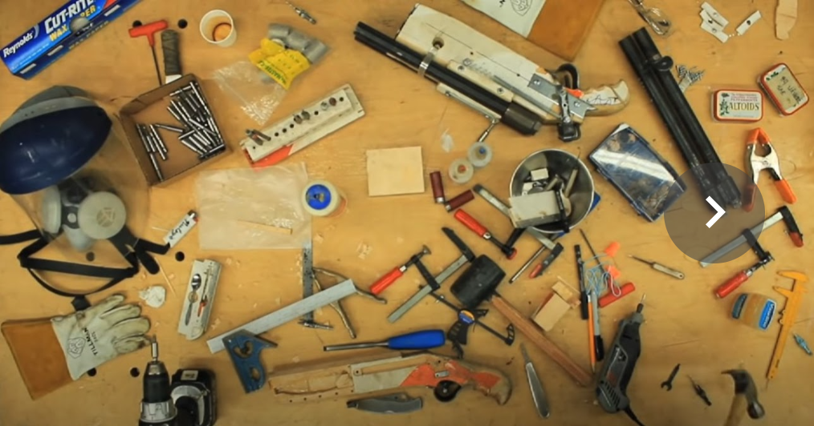
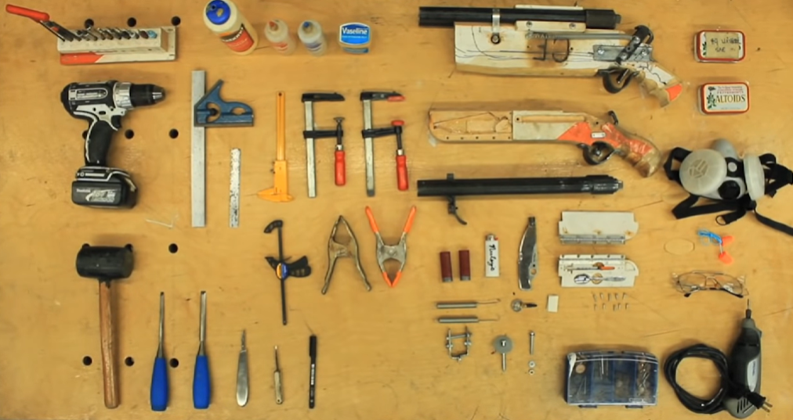

le Fablab d'imt-atlantique essaye de s'approcher au plus près des valeur originel de l'invention de ces lieux par le MIT

N'hésitez pas à vous raffraichir la mémoire en parcourant les lignes de la [chartre des fablabs](chartes.md)

# le labfab

Le labfab est un espace mutualisé, il est donc utilisé par de nombreuses personnes.

En tant que fabmanager je vous propose des outils pour que le lab reste simple et agréable à utiliser pour tous.

Chacun doit se sentir Gardien et responsable du lieu.

Si vous voyez quelqu'un qui utilise le lab de façon impropre ou dangereuse...aider le en lui rappelant les règles de sécurité

Si vous voulez améliorer l'ergonomie vous pouvez proposer dans le carnet "proposition" des amélioration, une nouvelle disposition de l'atelier.

## Comportement

Il y a une règle fondatrice du fablab

**"be excellent to anyone"**

Les attentions pour le lieu ou pour les autres doivent dépasser ce qu'on à l'habitude de faire pour soi.

On essaye au mieux de ses capacités du jour, d'être le plus "**bienveillant**" possible envers les autres.

Chacun à une expérience différente. il n'y a pas qu'une seule solution à un problème et chacun peu explorer sa solution.

Une des plus value du labfab est justement d'expérimenter sa solution personnelle sans être jugé. Bien sur d'étre confronté aux regard des autres, à une façon différente d'appréhender la situation est source d'enrichissement.

La phrase qu'on trouve souvent dans les labfab

"C'est celui qui fait qui a raison " se refère aux comportements des inspecteurs des travaux finis  qu'on ne préfère pas rencontrer au lab.

Pour ma part je préciserais
"celui qui fait avec ses propres ressources et qui ne porte atteinte à autrui à raison."

## Chaque chose à sa place

Si on était dans une bibliothèque on dirait "un livre déplacé est un livre perdu."

la version lab serait "le tournevis n'est plus à sa place, t'as qu'a prendre un marteau "

(ce qu'on ne souhaite pas) ndlr 

Beta test :
j'ai donc essayé de mettre une place pour chaque chose
il y a de petits cartons postaux avec des post it pour l'instant
Chaque boite à une thématique.

Si on a pas fini son projet et qu'on doit précipitament s'absenter on peut s'adonner au "knolling" une sorte de mise au carré de son bordel qui permet aux autres de l'accepter.

knolling from ten bullet / tom sachs

<iframe width="560" height="315" src="https://www.youtube.com/embed/s-CTkbHnpNQ" title="YouTube video player" frameborder="0" allow="accelerometer; autoplay; clipboard-write; encrypted-media; gyroscope; picture-in-picture" allowfullscreen></iframe>

## le ménage

Chaque personne utilisant un atelier doit le rendre dans son état d'origine 
il y a une image sur son état d'origine on doit s'y référer
les outils doivent être rangé à leurs places (rappeler vous que leur places est identiques pour tous)
les petits bouts de cuivre, de gaine,de bois ,de colle , de soudure ... de tout ce qui traîne doivent finir au recyclage.

* Balais 
* Balayettes
* Pelles
* Poubelles

sont à disposition.

### plus d'info sur le recyclage

to do

## l'emprunt & le don

On emprunte ce qu'on veut 
mais on le dit haut et fort (ça veut dire à laurent Mattlé)
Emprunter ça ne veut pas dire à vie, (on doit donner une date à laquelle on doit la retourner)

le lab n'est pas une boutique, c'est une mise en commun de nos ressources.
une fois que vous avez explorer votre projet plutôt que de le laisser dans un tiroir vous pouvez laisser la possibilité aux ressources d'avoir une nouvelle vie (et si le prochain projet changera le monde de demain vous serez donc l'origine du changement et ce pour un effort minime;-) 

Vous pouvez aussi apporter ce que ; vous n'utilisez plus, prend de l'espace inutilement chez vous  et que vous pensez d'un interet pour la communauté.

## Note d'intention (béta)

Vous êtes le bienvenue dans l'espace, pour chercher des informations, pour venir aider, pour discuter..... mais si vous voulez utiliser les outils du fablab pour vous aider à réaliser vos projets nous avons mis en place un espace pour que vous inscriviez une note d'intention pour votre projet
ça peut être :

le **1/04/2020** : tom :
note :  je veux refixer le garde boue de mon vélo et j'ai besoin d'une vis et des outils : et voila une petite photo de mon vélo

ou bien le départ de la documentation de votre projet
(Si c'est dans le cadre de l'école vous en avez besoin pour faire votre rapport)
Le lab est la aussi pour aider à structurer votre projet et trouver la bonne façon pour valoriser votre temps, vos connaissances et vos compétences.

Pourquoi faire ça :
* pour savoir que le lab à un boulon en moins.
* pour avoir un retour sur des choses qui ne fonctionnerait pas ou qui manquerait
* pour vous aider à finir ce que vous avez commencer. Chaque projet ouvert reçoit notre * indéfectible support et relance.
* pour avoir une trace visuelle de ce qui se passe dans le lab (si vous aimer avoir des photos de vos pôtes lors de la dernière petites bouffe entre amis le lab aime aussi se rappeler de votre passage)
