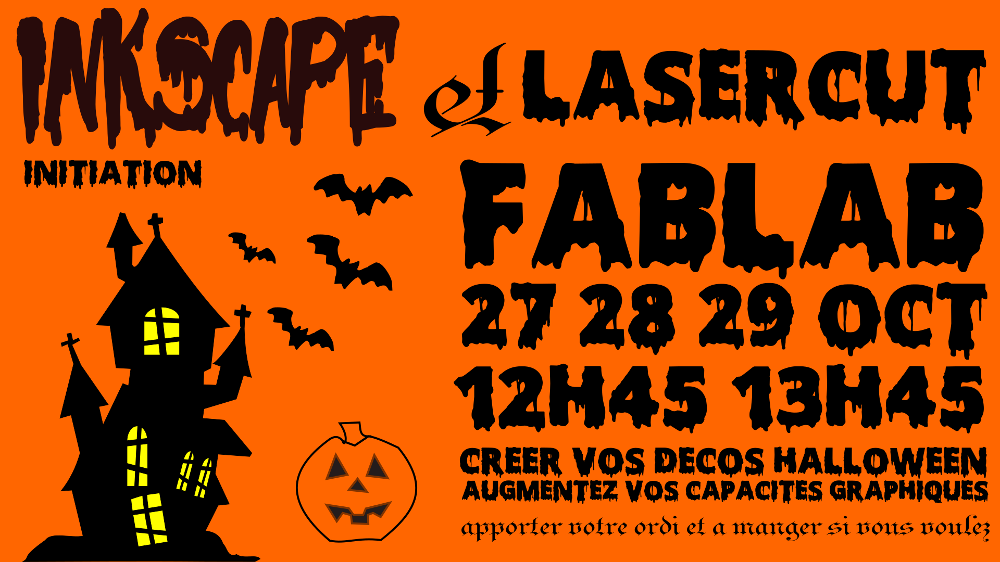

# Halloween

Période Octobre (jusqu'au 30octobre date d'Halloween)

Halloween est un moment festif, accompagné de déguisements, maquillages décorations.
Parfait pour investir le fablab.
## Affiche :

<figure markdown>
  { width="400" }
  <figcaption>Halloween</figcaption>
</figure>

Sont proposés des ateliers qui ont un but pédagogique.

## Toile d'arraignée  

- Outil spiral
- Droite(bezier)
- épaisseur de trait (stroke)
- Contour en chemin
- Union
- type de noeud

## Maison hantée

## Citrouille

Choisir un angle du document
Dessiner une spiral à l'angle elle deviendra la toile
Dessiner avec l'outils bézier les fils d'accroche en partant du bord de l'espace de travail jusqu'au centre

[les ressources sur github]()
