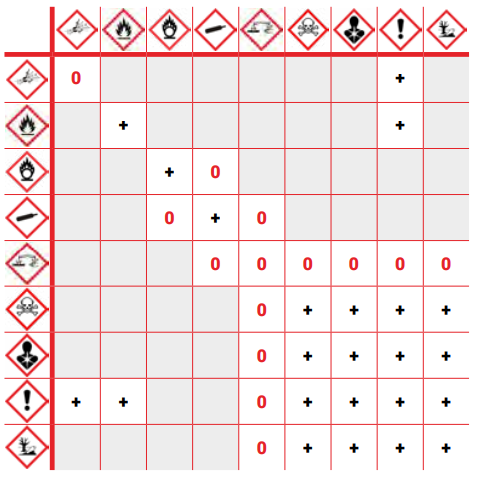

# Le tableau des compatibilités chimiques

! Certains produits sont susceptibles d’interagir les uns avec les autres.
Les interactions peuvent provoquer des explosions, des incendies, des projections ou des émissions de gaz dangereux.
Ces produits incompatibles doivent être stockés séparément afin d’éviter les accidents.
  

+ Les produits peuvent être stockés ensemble.
0 Les produits peuvent être stockés ensemble
que si certaines dispositions sont appliquées.
  Les produits ne peuvent pas être stockés
ensemble