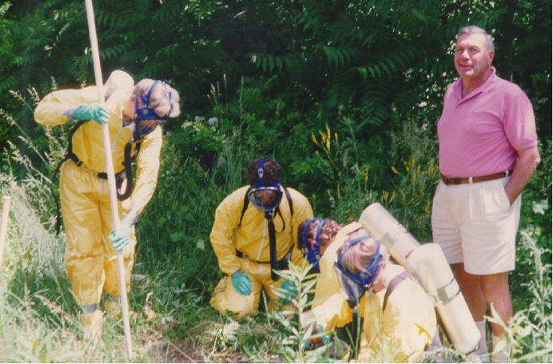
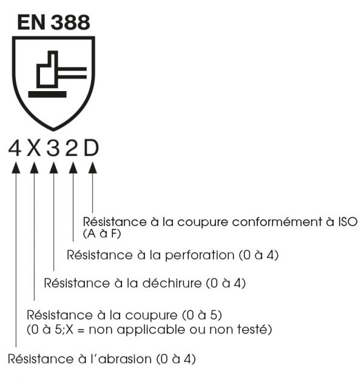

# Sécurity First

  

## Sécurité

Le lab possède bien des outils qui peuvent être dangereux

Vous pouvez être couper
Vous pouvez être brûler
Vous pouvez être empoisonner ...

De façon générale vous pouvez endommager sérieusement des fonctionnalité de votre corps.

Vous pouvez abîmer les outils ou le mobilier ( mais il ne faut pas le faire)

Vous devez avant toute chose prendre possession de toutes les informations concernant le poste de travail, son usage , ses mesures de sécurité, 

- une liste de chose à faire en cas d'urgence.
- une liste des secouriste du travail.
- #todo plan et position des sst 
  

- Le lab possède une trousse de secours
[img_emplacement ]

- Deux extincteurs
- Type d'extincteur
  #todo

- Une liste de chose à faire en cas d'urgence

Il faut donc savoir ou se trouve ces éléments

Il faut au moins avoir lu une fois la fiche sécurité de chaque outil utilisé

le but du site est de vous apporter toutes les informations.
Si certaine manquerais vous nous informeriez.

## EPI (équipement de protection individuel)

Sont à votre disposition 

Masques.
Gants.
Lunettes.
Bouchons d'oreille !

Vous devez les utiliser pour vous proteger.

### Gants

la norme EN 388 spécifie les caractéristiques des gants en fonction de leur résistance aux agressions mécaniques.

  
  
ABRASION : niveau 1 à 4 (évaluée en nombre de cycle)
COUPURE : niveau 1 à 5 (évaluée en nombre de cycle)
PERFORATION : niveau 1 à 4 (évaluée en Newton)
DÉCHIRURE : niveau 1 à 4 (évaluée en Newton)
COUPURE ISO 13997 : niveau 0 à F (évaluée en Newton)
IMPACT : niveau 0 ou P (évaluée en Kilonewton)

X . . . . . . . Non testé

0 . . . . . . . Nul

1  . . . . . . . Minimum

2 . . . . . . . Bon

3 . . . . . . . Très bon

4 et +  . . . Excellent

