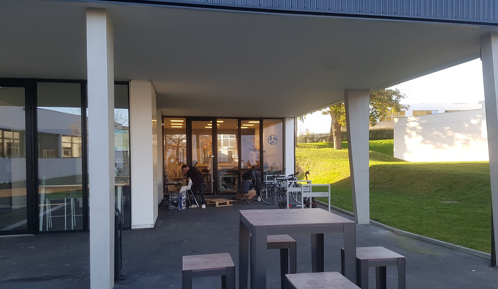

# Bienvenue au labfab d'imt-atlantique-Rennes

  

## Ouverture 

Toujours disponible !

- Soit votre badge vous y donne accès (et vous avez lu  les impératifs des outils que vous voulez utiliser et vous vous êtes formé à l'utilisation des outils que vous voulez utiliser.
  
- Soit vous demander un rendez vous à laurent Mattlé qui vous accompagnera ( c'est la méthode à privilégier)

## Actualité

### hackathon Petit bot

> Tremplin numérique : un objet roulant télécommande en wifi, des contraintes esthétique de folie.
> Le tout soupoudré de gestion de projet, communication, et bien d'autres joyeusetés .....

## Localisation
le lab est situé au rez-de-chaussée du batiment Cencyble.

<iframe src="https://www.google.com/maps/embed?pb=!1m18!1m12!1m3!1d1102.0602684196567!2d-1.6299611430085004!3d48.11980847214432!2m3!1f0!2f0!3f0!3m2!1i1024!2i768!4f13.1!3m3!1m2!1s0x480edec2e1365769%3A0xc72570a271e838c1!2sRue%20de%20la%20Ch%C3%A2taigneraie%2C%2035510%20Cesson-S%C3%A9vign%C3%A9!5e1!3m2!1sfr!2sfr!4v1665050385612!5m2!1sfr!2sfr" width="600" height="450" style="border:0;" allowfullscreen="" loading="lazy" referrerpolicy="no-referrer-when-downgrade"></iframe>

## Contact

:octicons-mail-24: laurent.mattle@imt-atlantique.fr

:material-cellphone: 0673472005
