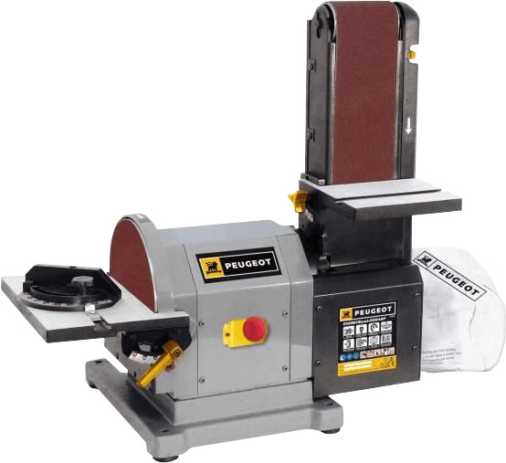

# Combiné Peugeot ENERGYSAND-200ASP

  

## Sécurité
- Utiliser des gants et des lunettes de protection
- Repérer le bouton d'arret d'urgence.(soyez prêt appuyer à n'importe moment)
- Faire attention à vos vétements et cheveux, écharpe vêtement large cheveux long peuvent être hapé par la machine
- Faire attention que la machine fonctionne simultanément à deux endroits (ponceuse à bande en face et disque sur le coté)
- utiliser cale ou outils intermediaire pour ne pas appocher les doigts trops prèts, ne vous sentez pas totalement protégé avec vos gants, ils peuvent être entrainé.

## Usage
- Utiliser le combiné dehors.
- Malgrès son sac à poussière, son utilisation créé beaucoup de poussière.
- Une fois terminé vidé le sac en tissus dans la poubelle prévue pour cette usage, avant de rentrer le combiné.

