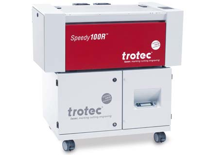
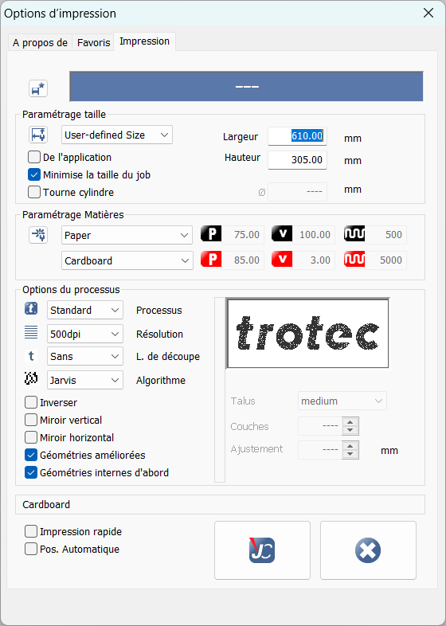
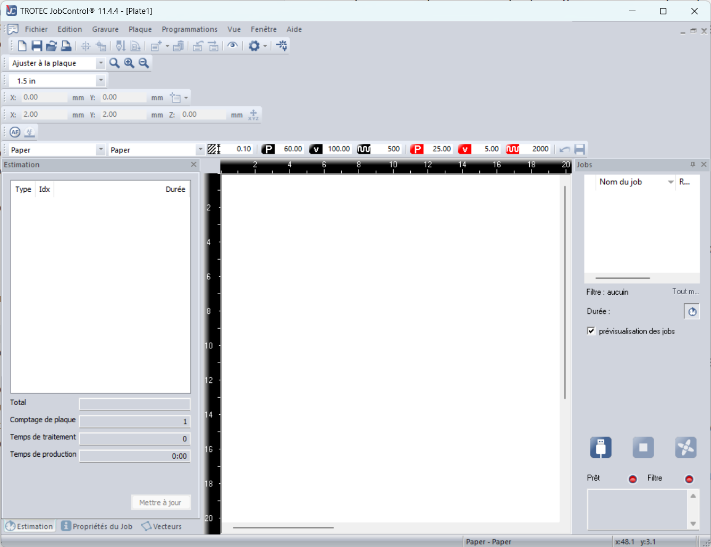

## Découpeuse laser

### Trotec Speedy 100

  

Type de laser : laser CO2
Surface de travail : 610 x 305 mm
Hauteur de pièce max. : 200 mm
Puissance du laser : 30 Watts

## Sécurité

### :material-head-alert: les matériaux que vous ne pouvez pas découper.
- Pas de medium (cancerigène depuis 2004),
- Pas de chlore(comme le pvc),
- Pas de fluor (Téflon /Polytétrafluoroéthylène / PTFE…)
- et donc pas de plastic inconnu.
- Les matériaux réfléchissant : miroirs, objets chromés, métaux polis(on peut recouvrir la partie réfléchissante avec une poudre matifiante.)
- Les métaux
- Fibre de verre
- PCB (Fibre de verre + époxy)
- Fibre de carbone
- Polycarbonate / PC / Lexan / Makrolon : fond et brûle
- Polystyrène expansé/extrudé (mousse): fond et brûle
 
Vous pouvez tenter de savoir à quel matériaux plastique vous avez affaire en suivant [ce protocole]()

:material-skull-crossbones-outline: c'est important par exemple le PVC découpé à la laser atteint vos poumons et en réduise à vie leurs capacités(insuffisance respiratoire). mais bon,vous ne mourrez pas et il existe des systèmes de respiration assisté et transportable ;-)

## Usage

il est préférable de ne pas dépasser 10 mm pour le bois et 10 mm pour le plexiglass.

la plupart des matériaux sont organiques, ça veut dire que leur propriétés diffèrent selon leurs échantillons. il est donc recommandé de toujours faire des tests avec le matériaux cible.

Le logiciel qui controle la découpe laser est : **Jobcontrol**
Il se compose d'un driver d'impression ainsi q'un logiciel de control.

Le driver permet de créer un fichier au format de coreldraw dans un chutier(option/spool).
il est souhaitable que vous ne touchiez pas ses réglages.
 
 
 et celui ci sera repris par le logiciel de control qui le présentera dans une fenêtre sur la droite de l'interface
TODO gif glisse chutier> zone de travail et oeuil

