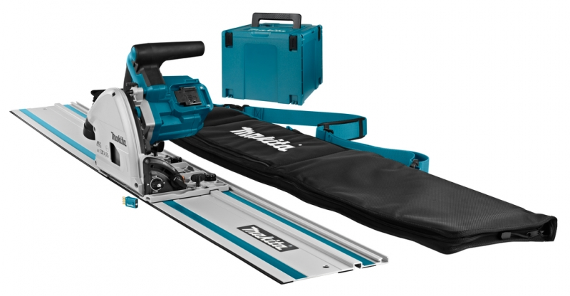
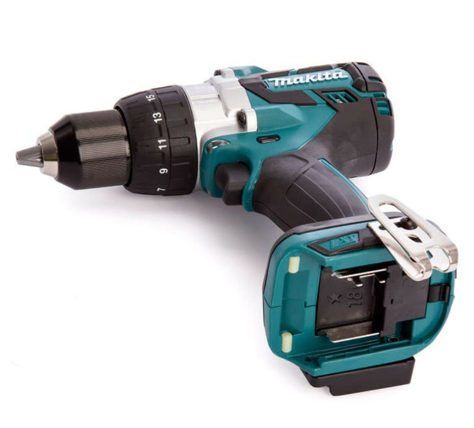

# Outils Élèctroportatifs

le lab posséde une collection électroportative comprenez des outils alimentés par des batteries.
ils permettent de travailler en extérieur sans avoir de "fil à la patte".

Toutes la collection utilise le format de batterie MAKITA 18v
le lab mutualise donc deux batterie 18v 6 

## Scie plongeante circulaire DSP-601

Modèle : DSP600 DSP601
Diamètre de lame 165 mm
Profondeur max. de coupe à 0° 56 mm
en biseau à 45° 40 mm
en biseau à 48° 38 mm
Vitesse à vide 2 500 à 6 300 min-1
Longueur totale 346 mm
Tension nominale 36 V CC
Batterie BL1815N, BL1820, BL1820B, BL1830, BL1830B, BL1840,
BL1840B, BL1850, BL1850B, BL1860B
Chargeur DC18RC, DC18RD, DC18SD, DC18SE, DC18SF
Poids net 4,4 à 5,1 kg

[le mode d'emploi](assets/Makita_scie_DSP601.pdf)

:material-alert: le lab possède la règle Makita 194925-9
1900 mm,2.7kg.

Il va sans dire que celle ci est fragile et que c'est un outil de précision toute déformation ou choc peuvent la rendre inutilisable.
elle est à remettre délicatement dans sa boite en carton après usage.

:material-alert: l'emsemble des batteries du lab sont nescessaires pour la faire fonctionner ;-)

En cas d'emprunt une boite adaptée est disponible

## Perceuse visseuse 18 V -MAKITA DDF 481

[le mode d'emploi](assets/DDF481.pdf)

## Ponceuse vibrante

#todo
## scie sauteuse

#todo