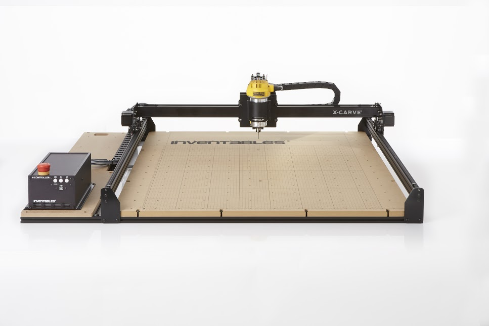
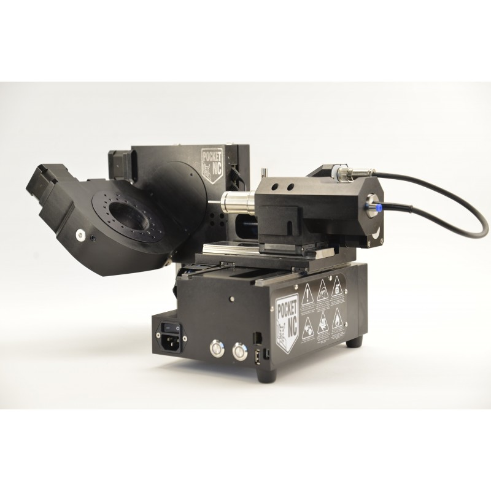

# les fraiseuses numériques

## X carve
 
Zone de travail : 500x500

## X carve xl
 
Zone de travail :1000x1000

## Pocket NC
  
Specification:

Axis Maximum Travel Speed
X 115.5 mm 60 (1524 mm/min)
Y 128.3 mm  (1524 mm/min)
Z 90.1 mm (1524 mm/min)
A -25° to 135° 40°/second
B Continuous rotation (-9999° to 9999°) 40°/second

Axis Backlash
X & Y 0.0005 in (12.7 µm) at tool base
Z Backlash at 8.16 kg load: 12.7 µm
A & B 0.01°

Axis Resolution and Repeatability
XYZ Resolution: 6.10µm
Homing Repeatability: ±12.7µm
Repeatability: ±50.8µm at 0% load
A & B Resolution: 0.01°
Homing Repeatability: ±0.05°
Repeatability: ±0.05° at 0% load

Runout: < 50.8 µm
Spindle
Spindle Speed 1,000-50,000 RPM*
Power 200 W
Spindle Motor BLDC 3 Phase with Hall Feedback
Spindle Runout 0.0001 in (2.5 µm)
Tool Change Lever Type
CHB Collet
