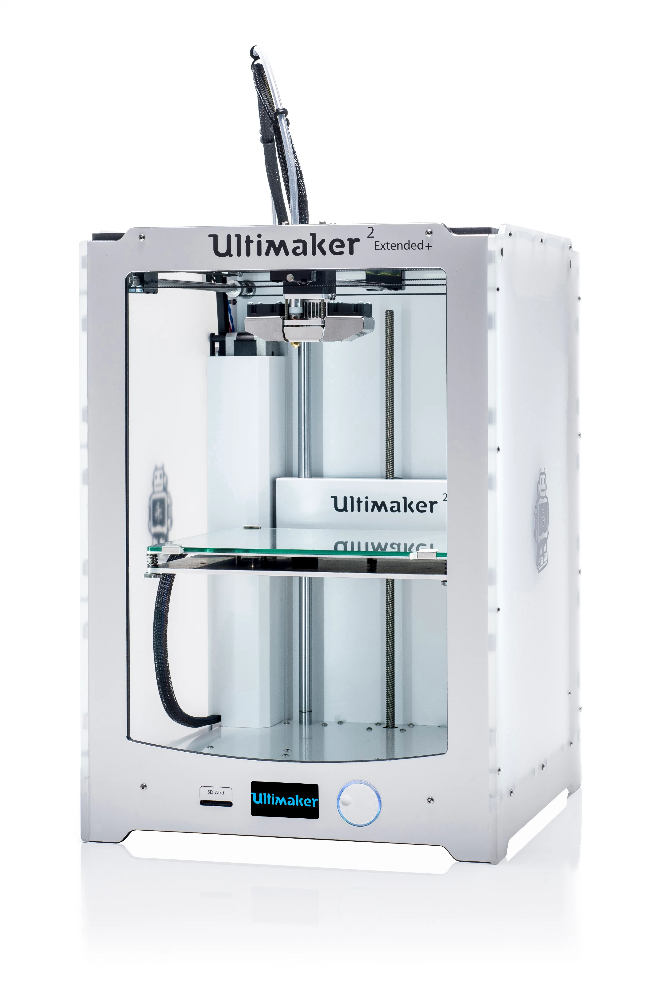
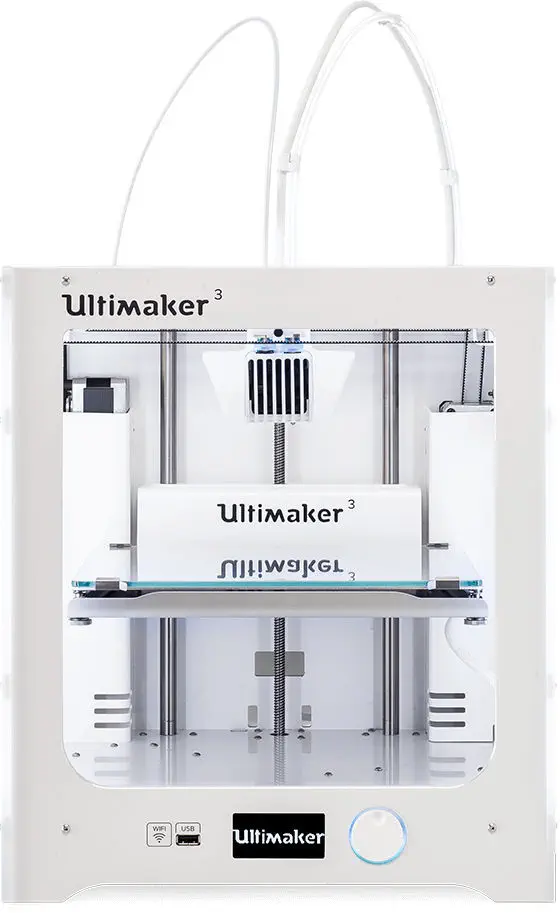

# Machines

le lab possède des machines
Vous devez lire ce document pour les utiliser.
il contient quelques remarques pour éviter de vous mettre en danger ou d'abimer le matériel.

## les imprimantes 3D :

### Sécurité mécanique

les imprimantes contiennent des pièces mobiles. Les courroies d’entraînement ne doivent causer aucun dommage à l’utilisateur. La force du plateau est suffisamment élevée pour causer des dommages. Il convient donc de garder vos mains hors de la portée du plateau pendant le fonctionnement.
Débranchez toujours l’imprimante avant de procéder à des travaux de maintenance ou des modifications.

### Risque de brûlures

Il existe un risque potentiel de brûlures : la tête d’impression peut atteindre des températures allant jusqu’à
280 °C, tandis que le plateau chauffant peut atteindre 100 °C. Ne touchez pas ces deux éléments à mains nues.
Laissez toujours l’imprimante refroidir pendant 30 minutes avant de procéder à des travaux de maintenance
ou des modifications.

### Santé et sécurité

Les matériaux des filaments peuvent dégager des COV (composés organiques volatils) lorsqu’ils sont traités dans les
imprimantes. Cela peut causer des maux de tête, de la fatigue, des vertiges,de la confusion, des nausées, des malaises, une difficulté de concentration et un sentiment d’intoxication. 

Imprimer en un lieu bien ventilé. Pour plus d’informations, consultez la FDS(fiche de sécurité) de chaque matériau spécifique.

### Ultimaker2 

### Ultimaker2 extended + 

  

### Ultimaker3

  

[le manuel en français](https://support.ultimaker.com/hc/en-us/article_attachments/360010854759/Ultimaker_3_manual__Fr_.pdf)

[tout le support technique](https://support.ultimaker.com/hc/en-us/sections/360003548399-Ultimaker-3)

