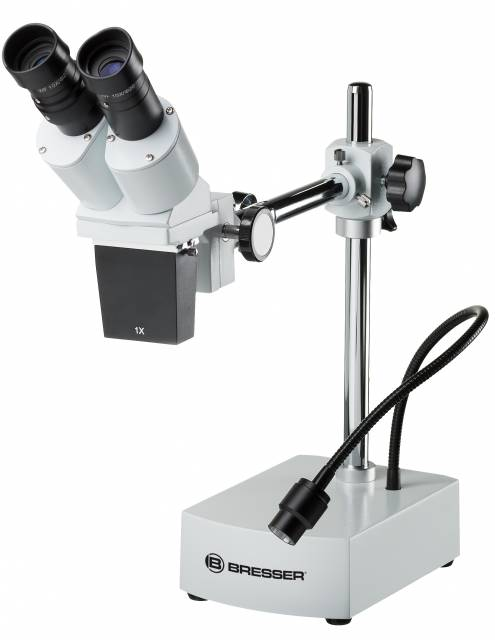

# Microscope Stéréo

un microscope stéréo (binauculaire) permet de voir les détails de votre travail, que ce soit une soudure, un réglage de la découpe laser, de l'impression 3D.

  

Pour l'utiliser

- Allumer la lampe avec l'intérupteur situé à l'arrière
- placer l'objectif à 22 cm de l'objet que vous voulez observer
- réglez l’écartement interpupillaire des oculaires de façon à obtenir un seul cercle dans votre champ visuel.
- Réalisez la mise au point en utilisant la molette
- Régler le microscope a votre vue 
  - Tournez la bague d’ajustement dioptrique gauche sur l’oculaire gauche pour l’amener sur la position centrale (marque grise).
  - Fermez ensuite votre oeil gauche et regardez
avec l’oeil droit à travers l’oculaire droit. Faites la mise au point à l’aide de la molette, jusqu’à l’obtention d’une image parfaitement nette pour votre oeil droit.
  - Regarder avec votre oeil gauche à travers l’oculaire. Si l’image observée n’est pas parfaitement nette, faites le mise au point pour l’oeil gauche en tournant la bague de réglage dioptrique.

:material-alert-outline: N'oubliez pas de fermer la lumière une fois vos observations finies ! 

[Pour en savoir plus](assets/Bresser_microscope.pdf)
