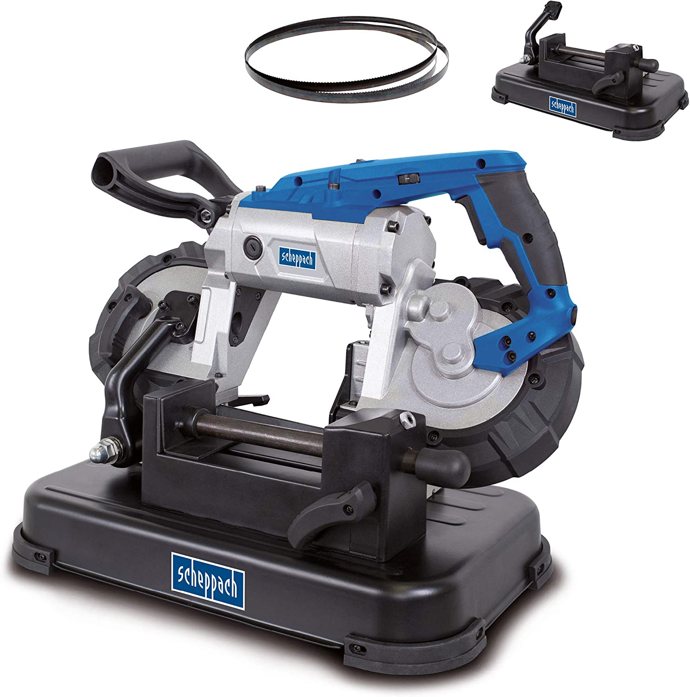
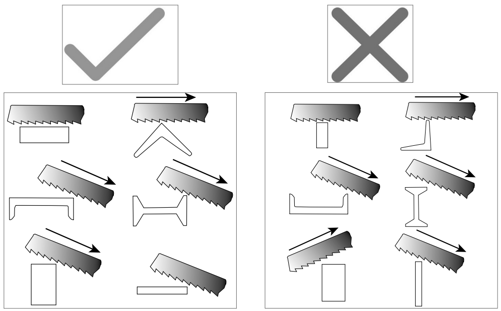

# Scie Ruban 

Scheppach MBS1100

  

## Caractéristiques techniques
Moteur à courant alternatif 220 - 240 V ~, 50
Hz
Puissance 1100 W
Classe de protection II
Ruban de la scie 1 140 x 12,7 x
0,65
Vitesse du ruban de la scie 0,7 - 2,4 m/s
Largeur de coupe 90° 127x80 mm
Largeur de coupe 45° 40x80 mm
Coupe d’onglet 0°-45°
Poids Scie à ruban métallique 6,6 kg
Poids 13,6 kg

## Rappel :

- Porter gants et lunettes
- Ne pas forcer sur la lame (le poid de l'outil suffit)
- Utiliser un lubrifiant
- Respecter les consignes de découpe :
  